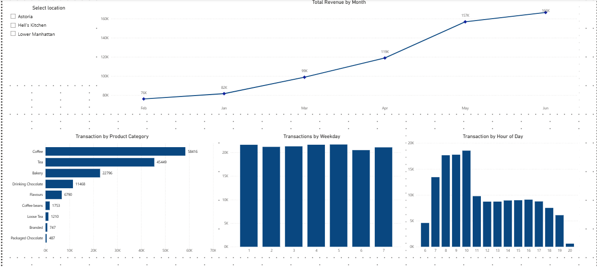

# Coffee Shop Sales Analysis / Educational Project

This project serves as an educational exercise designed to showcase skills in data extraction, transformation, and visualization using Power BI. The focus is on analyzing operational performance and consumer behavior within a coffee shop chain.

## Data Sources

* **Source File:** The raw data used for analysis is available in the Excel file within this repository.
* **File Location:** [coffee_shop_transactions.xlsx](../../data/coffee_shop_transactions.xlsx)  
* **Data Type:** Transactional sales data, containing individual purchase records.

## Learning Objectives

The primary goal of this project is to master key functionalities within Power BI Desktop, specifically:
* **Visualization:** Constructing various chart types (line, bar, histogram) for effective storytelling.
* **Data Modeling:** Creating robust relationships and hierarchies for analyzing data by category, date, and location.
* **DAX:** Creating calculated measures for key metrics (e.g., Total Revenue, Total Transactions).

---

## Dashboard Overview and Key Metrics

The dashboard is organized into three main analytical sections, offering actionable insights:

### 1. Financial Dynamics (Total Revenue by Month)

* **Observation:** The Total Revenue shows a consistent **upward trend** from February through June, peaking at **160K** in June.
* **Skill Demonstrated:** Building a line chart for **time-series analysis**.

### 2. Sales Structure (Transaction by Product Category)

* **Top Products (by Transactions):**
    * **Coffee:** 58,416 transactions.
    * **Tea:** 45,449 transactions.
    * **Bakery:** 22,795 transactions.
* **Skill Demonstrated:** Using horizontal bar charts to visualize the **distribution** and ranking of product categories.

### 3. Customer Behavior (Transactions by Weekday & Hour of Day)

* **Peak Days:** Transactions remain consistently high throughout the entire week (Days 1–7).
* **Peak Hours:** The highest traffic is observed in the morning, specifically **from 9:00 AM to 11:00 AM**, which is critical for optimizing staff allocation.
* **Skill Demonstrated:** Creating histograms to analyze **temporal patterns** in customer activity.

---

## Technical Details

| Aspect | Details |
| :--- | :--- |
| **Tool Used** | Power BI Desktop |
| **Key Technologies** | DAX, Power Query (M) |
| **Data Type** | Transactional data from coffee shop sales |
| **Filtering Capabilities** | By Store Location (Astoria, Hell's Kitchen, Lower Manhattan) |

## Project Visualization

